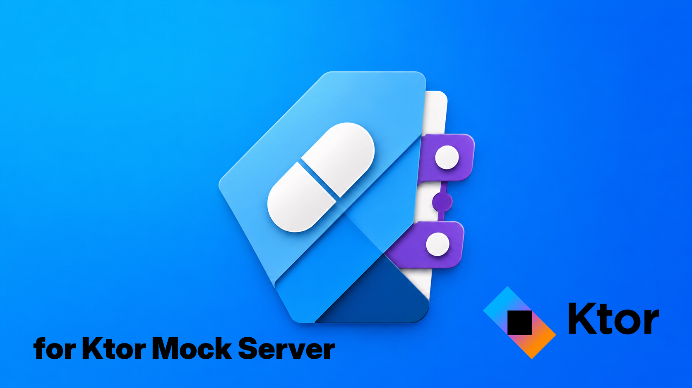
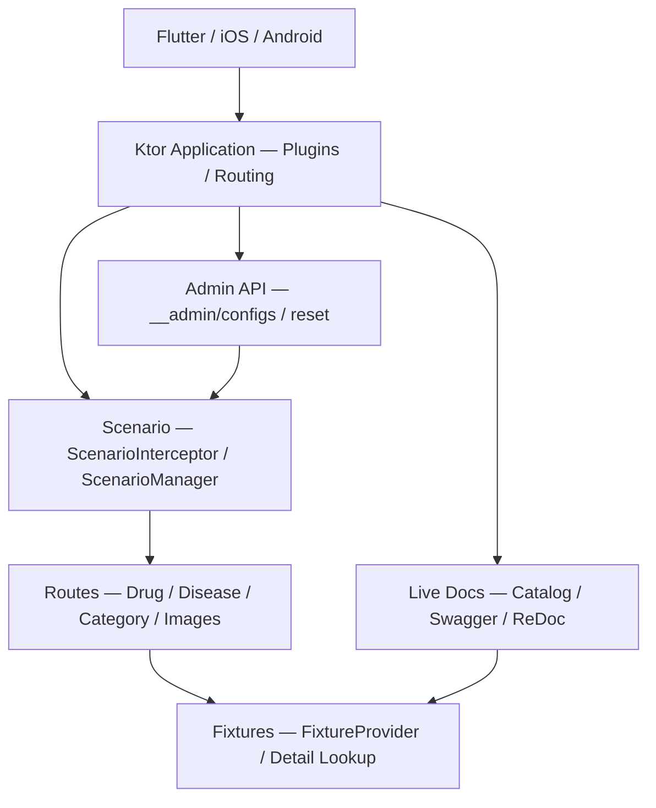

<!-- markdownlint-disable MD013 MD033 MD041 -->



# fictional-drug-and-disease-ref-mock-server

医薬品・疾患リファレンスアプリ用に作成した、個人ポートフォリオの Scenario-based Mock Server です。Flutter / iOS / Android クライアントが同じ API を共有する前提で設計しており、シナリオは HTTP ヘッダーまたは Admin API で切り替えられます。クライアント実装の例: [fictional-drug-and-disease-ref-flutter](https://github.com/Corvus400/fictional-drug-and-disease-ref-flutter)。

[](https://kotlinlang.org/)
[](https://ktor.io/)
[](./LICENSE)
[](https://pre-commit.com/)

## DISCLAIMER

これは架空の医薬品・疾患データを返すモックサーバーです。
内容は実在の医薬品・疾患・治療法を表すものではなく、
医療判断・診療・自己判断に使用してはなりません。
This server returns FICTIONAL drug and disease data.
DO NOT use for medical decisions or clinical practice.
医療判断に使用してはなりません。

詳細は [DISCLAIMER.md](DISCLAIMER.md) を参照してください。

## 主な特徴

- **状態を固定できる Mock Server** — `X-Mock-Scenario` は単発確認、Admin API は画面全体の固定に使えます。
- **クライアント共通の fixture API** — Flutter / iOS / Android が同じレスポンスで UI を確認できます。
- **仕様確認がすぐできる** — `/__admin/catalog`、`/swagger`、`/redoc` をサーバー起動だけで開けます。
- **追加パターンが単純** — Model、Fixture、Route、Routing 登録の順でエンドポイントを増やします。
- **架空データ前提を明示** — README、免責文、API 側で実在データとの混同を避けます。

## クイックスタート

1. 初回セットアップ:
   ```bash
   ./scripts/setup.sh
   ```
2. サーバー起動:
   ```bash
   ./scripts/start.sh
   ```
3. ブラウザで確認:
   - [対応画面・シナリオ・Fixture概要カタログ](http://localhost:8080/__admin/catalog)
   - [Swagger UI](http://localhost:8080/swagger) / [ReDoc](http://localhost:8080/redoc)
4. サーバー停止:
   ```bash
   ./scripts/stop.sh
   ```

## 動作環境

- macOS（Apple Silicon）
- JDK 21+
- Apple Container

## アーキテクチャ

シナリオベースの Mock Server です。Admin API または `X-Mock-Scenario` ヘッダーでレスポンスを動的に切り替えられます。



### シナリオ解決の優先順位

1. `X-Mock-Scenario` ヘッダー（最優先）
2. Admin API override
3. デフォルトシナリオ

ヘッダーは個別リクエスト単位の切替に、Admin API はグローバル状態の固定にそれぞれ使います。

### エンドポイント追加パターン

Model → Fixture（`FixtureProvider<T>`）→ Route（`scenarioRoute<T>()`）→ Routing.kt 登録の 4 層構成です。
詳細は Claude Code の `add-fixture` スキルを参照してください。

## Admin API

シナリオ切り替え・状態管理のための管理用 API です。

```bash
# 全エンドポイントのシナリオを確認
curl -s http://localhost:8080/__admin/configs | jq

# 特定エンドポイントのシナリオ切り替え
curl -X POST http://localhost:8080/__admin/configs/drugs \
  -H "Content-Type: application/json" \
  -d '{"state": "empty"}'

# 全状態リセット
curl -X POST http://localhost:8080/__admin/reset
```

### X-Mock-Scenario ヘッダー

```bash
curl -H "X-Mock-Scenario: empty" http://localhost:8080/api/drugs
```

## ライブドキュメント

サーバー起動後、以下の URL で詳細情報を確認できます。コードから自動生成されるため手動メンテナンスは不要です。

| パス                 | 説明                              |
|--------------------|---------------------------------|
| `/__admin/catalog` | 対応画面・シナリオ・Fixture概要カタログ         |
| `/swagger`         | Swagger UI（API仕様・リクエスト/レスポンス詳細） |
| `/redoc`           | ReDoc（リファレンス形式のAPI仕様）           |
| `/openapi.json`    | OpenAPI仕様（JSON形式）               |

## 開発

```bash
# ビルド
./gradlew build

# テスト
./gradlew test

# コードスタイル確認・修正
./gradlew spotlessCheck
./gradlew spotlessApply

# 静的解析
./gradlew detektMain

# Fat JAR
./gradlew buildFatJar
```

### コミット前ゲート (pre-commit)

CI の lint job はローカルゲートに移管しています。初回のみ pre-commit をインストールし、Git hook を有効化してください。

```bash
brew install pre-commit
pre-commit install --hook-type pre-commit --hook-type pre-push
```

`core.hooksPath` を設定している環境では `pre-commit install` が拒否されます。その場合は既存のグローバル hook から以下を呼び出してください。

```bash
pre-commit run --hook-stage pre-commit
pre-commit run --hook-stage pre-push
```

- `pre-commit` stage: `git fetch origin main` 後に `./gradlew spotlessCheck -Pspotless.ratchet=true`
- `pre-push` stage: `./gradlew detektMain` / `./gradlew detektTest`
- Markdown・Shell・YAML など対象外ファイルだけの変更では、各 hook は何もせず成功終了する
- 全件確認: `pre-commit run --all-files`
- push gate の全件確認: `pre-commit run --hook-stage pre-push --all-files`
- 一時的に detekt をスキップ: `SKIP=gradle-detekt-main,gradle-detekt-test git push`

Spotless は `origin/main` からの差分に ratchet します。古い base を参照しないよう、pre-commit stage は Spotless 実行前に `git fetch origin main` を自動実行します。

## ドキュメント方針

> 本 README にはコードから導出できる情報・陳腐化する情報は記載しません。
> 詳細は [ADR: README に陳腐化する情報を書かない](docs/adr/20260316_READMEに陳腐化する情報を書かない.md) を参照してください。

アーキテクチャ図は、ポートフォリオとして初見で責務境界を伝えるための概念図です。API・シナリオ・Fixture の詳細はライブドキュメントを正とします。

## 技術スタック

- Kotlin / Ktor / JDK 21+
- kotlinx.serialization（JSON処理）
- ktor-openapi-tools（OpenAPI / Swagger UI / ReDoc）
- Apple Container（コンテナ実行環境）
- Spotless + ktlint（コードスタイル）

バージョン詳細は [`gradle/libs.versions.toml`](gradle/libs.versions.toml) を参照してください。

## Repository Operations

- 依存関係更新の Pull Request は Renovate が管理
- GitHub Actions およびワークフロー依存関係の更新は手動レビュー
- 外部からの Pull Request は CI で拒否しレビュー対象外
- 一般的なサポート・機能要望・バグ報告は GitHub Issues では受け付けない
- セキュリティに関する報告は [SECURITY.md](./SECURITY.md) を参照

## ライセンス

MIT License です。詳細は [LICENSE](LICENSE) を参照してください。
